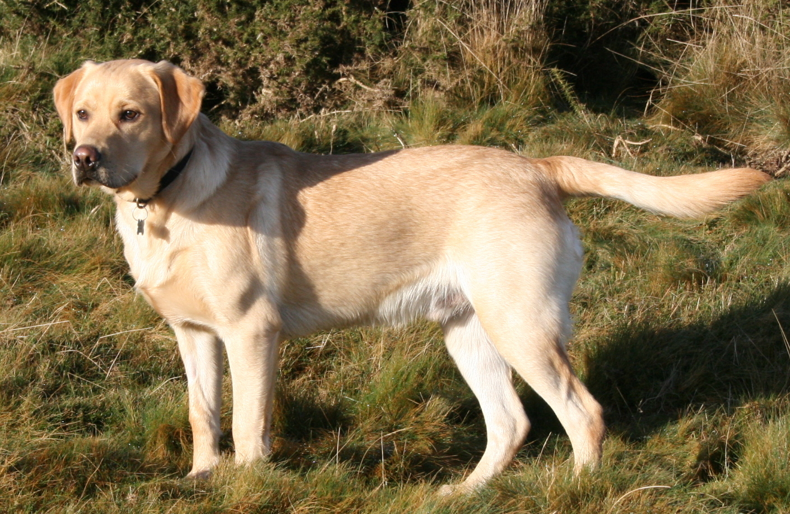

> [!NOTE]
> This is a task for Bundle E 

# Welcome to my website!

# Dog Breeds Photo Gallery

Click on the dog breed names to view their photos:

- [Labrador Retriever](#labrador-retriever)
- [German Shepherd](#german-shepherd)
- [Golden Retriever](#golden-retriever)

## Labrador Retriever

Labrador Retrievers are known for their friendly and outgoing nature.

Weight: 29-36kg
    - Life span: 10-12 years
        - Origin: United Kingdom 

## German Shepherd

German Shepherds are intelligent and versatile working dogs.

Weight: 30-40kg
    - Life span: 10+ years
        - Origin: Germany 

## Golden Retriever

Golden Retrievers are loyal and affectionate family pets.

Weight: 25-34kg
    - Life span: 12-13 years
        - Origin: Scotland 

## Contact Information

- **Email:** [Gmail](mailto:ville.m.ahola@gmail.com)
- **LinkedIn:** [LinkedIn](https://www.linkedin.com/in/ville-ahola/)
- **GitHub:** [GitHub](https://github.com/Ville-A)